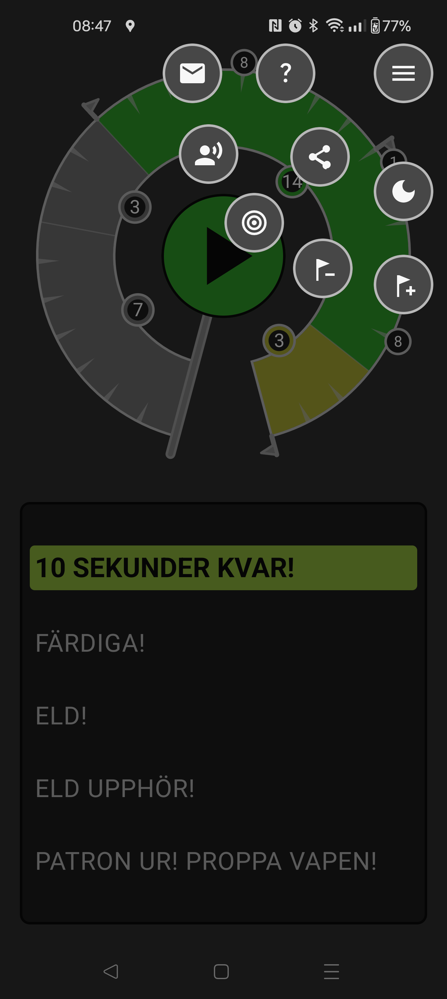
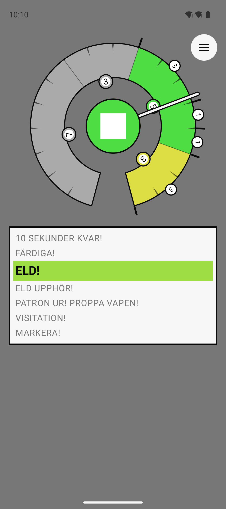

# Fältskyttetimer — Field Shooting Timer

A shot-timer for Swedish field shooting (fältskytte) and precision shooting. It plays the
standardized Swedish range commands — "Tio sekunder kvar", "Färdiga", "Eld", "Eld upphör",
"Patron ur, proppa vapen", "Visitation" — at exactly the right times, with a dial that shows
where in the sequence you are. Built with Kotlin Multiplatform + Compose Multiplatform and
shipped to both Android and iOS from one shared codebase.

<p align="center">
  
  
</p>

## Download

**[Download page with QR codes →](https://carlemil.github.io/FieldShootingTimer/)**

- [Android — Google Play](https://play.google.com/store/apps/details?id=se.kjellstrand.fieldshootingtimer)
- [iPhone — App Store](https://apps.apple.com/se/app/f%C3%A4ltskyttetimer/id6778128329)

## What it does

The dial **is** the interface — everything is adjusted directly on it:

- **Pinch the green Eld segment** with two fingers to set the fire time (5 s up to 5 minutes).
  It is the only configurable segment; the other commands run on their standard durations.
- **Partids** (string subdivisions) are planted as small flags on the dial's edge, with
  numbered badges showing each interval. Add or remove them from the menu, and **drag a
  flag** along the ring to move it. The app gives haptic feedback as the timer passes each one.
- **Drag the hand** of a paused timer to scrub to any second, or **tap a command in the
  list** to jump straight to where that command starts — playback resumes from there.
- The **radial menu** (top corner) fans out buttons for adding/removing partids, switching
  between competition and training mode, sharing the app, and reopening the tutorial.

Two modes:

- **Training** starts the command sequence immediately.
- **Competition** prefixes it with the full range procedure: "Ladda!", "Alla klara!" and a
  60-second preparation countdown shown on the play button. When the countdown hits zero the
  timer asks **"Alla klara!"** — continue into the sequence, or repeat the all-ready call.

Practical details: the screen stays awake while the timer runs, audio follows the phone's
ringer mode on Android (silent means silent) and the silent switch on iOS, portrait and
landscape are both supported, and a short tutorial runs on first launch. The app collects no
data, needs no permissions, and works fully offline. All voice and UI text is Swedish.

## Project structure

| Module | What it is |
|---|---|
| `shared/` | Kotlin Multiplatform + Compose Multiplatform library — all UI, domain logic, and the timer state machine live in `commonMain`, with Android/iOS `actual`s for audio, haptics, and screen-wake |
| `app/` | Android entrypoint (a ~20-line `MainActivity`) plus release signing and Play publishing |
| `iosApp/` | SwiftUI wrapper around the shared Compose UI, generated by XcodeGen, shipped via fastlane |

The command sequence is modeled by a single enum (`Command`) bundling each command's audio
clip, label, duration, and dial color — the timer plan, dial geometry, and cue times are all
pure functions derived from it, covered by host-runnable tests (including headless Compose
UI tests that run the actual gestures). See [CLAUDE.md](CLAUDE.md) for the full architecture
notes and build instructions, and [iosApp/README.md](iosApp/README.md) for the iOS setup.

## Building

```sh
# Android debug build
./gradlew :app:assembleProdDebug

# Run the host-side test suite (logic + headless Compose UI tests)
./gradlew :shared:testDebugUnitTest :shared:jvmTest :app:testProdDebugUnitTest
```

iOS requires macOS: `brew install xcodegen`, then `cd iosApp && xcodegen generate` and open
`iosApp.xcodeproj` — the shared framework builds automatically as a pre-build phase.

---

*Always practice in a safe and appropriate environment and follow local laws and regulations
regarding firearm usage.*
